<p align="center">
  
</p>

# subenum

Active and passive subdomain enumeration CLI for Bug Bounty reconnaissance.

`subenum` reads a list of root domains, queries **14 passive sources** in
parallel, brute-forces DNS with custom wordlists, generates smart permutations,
validates results via DNS, probes for live HTTP services, fingerprints
technologies, detects WAFs, audits security headers, identifies third-party
services, detects potential CNAME takeovers, extracts endpoints and secrets from
JavaScript files, enriches IPs with Shodan data, and exports everything to
structured output files ready for your Bug Bounty workflow.

Designed to run unattended on a VPS with full resume support after connection drops.

---

## Features

### Discovery
- **14 passive sources** — crt.sh, VirusTotal, urlscan.io, AlienVault OTX,
  HackerTarget, Wayback Machine, RapidDNS, Anubis DB, ThreatMiner, BufferOver,
  Chaos (ProjectDiscovery), GitHub code search, subfinder and amass.
- **8 free sources** that require no API key (crt.sh, AlienVault, HackerTarget,
  Wayback, RapidDNS, Anubis, ThreatMiner, BufferOver).
- **DNS brute-force** (`--bruteforce --wordlist`) — resolves every word in a
  custom wordlist as `word.domain`. Supports any txt wordlist with `#` comments.
- **Permutation/mutation engine** (`--permutate`) — generates label combinations
  from discovered subdomains. Accepts an external wordlist (`--wordlist`) to
  expand coverage; caps at 2 000 words to avoid combinatorial explosion (full
  wordlist is used for flat brute-force). Additionally applies targeted mutations
  to each discovered label automatically:
  - **Version patterns** — `api-v2` → `api-v1 … api-v6`, `v3-service` → `v1-service … v6-service`
  - **Trailing-number variants** — `dev1` → `dev`, `dev2`, `dev3`, `dev01`, `dev02`
  - **Numeric suffixes** — `api` → `api1`, `api-1`, `api01`, `api2`, `api-2`, `api02`
- **Recursive enumeration** (`--recursive`) — automatically re-enumerates
  discovered sub-zones (e.g. `*.internal.example.com`) for deeper coverage.
- DNS validation (A / AAAA / CNAME) with configurable resolvers and wildcard
  detection to eliminate false positives.
- Parallel async execution throughout for maximum speed.

### Analysis
- **HTTP/HTTPS probing** — status codes, page titles, server headers, cookies,
  body hash, live URL detection.
- **Technology fingerprinting** — detects 40+ technologies (WordPress, Jenkins,
  Jira, Grafana, Elasticsearch, etc.) and flags high-value targets with frequent CVEs.
- **WAF detection** — identifies Cloudflare, Akamai, Imperva, AWS WAF, Sucuri,
  F5 BIG-IP, Barracuda, Fastly, DDoS-Guard and more.
- **Security headers audit** — automatically checks every live host for missing
  or misconfigured security headers: HSTS, CSP (including `unsafe-inline` /
  `unsafe-eval`), X-Frame-Options, X-Content-Type-Options, Referrer-Policy,
  Permissions-Policy, CORS misconfigurations (`*`, `null`, credentials), and
  session cookie flags (Secure, HttpOnly, SameSite). Findings are rated
  `critical / high / medium / low / info`.
- **Third-party / CDN detection** — identifies subdomains pointing to Shopify,
  GitHub Pages, Heroku, CloudFront, Azure, Vercel, Netlify and 50+ other
  services via CNAME analysis.
- **Interesting subdomain tagger** — scores (1–10) and tags subdomains matching
  patterns for admin panels, staging environments, APIs, CI/CD, databases,
  internal tools and more. Scores are enriched post-probe with HTTP context
  (+2 for high-value tech detected, +1 for live without WAF).
- **Response deduplication** — groups live hosts by body hash. Hosts sharing an
  identical response (soft-404, generic login, maintenance page) are reported in
  `duplicates.json` and excluded from `unique_targets.txt` to reduce noise.
- **Port scanning** (`--scan-ports`) — async scan of 35+ high-value ports
  (Redis, MongoDB, Kubernetes API, Elasticsearch, etc.) on resolved hosts.
- **CNAME subdomain takeover detection** with 45+ service fingerprints.
- **Shodan enrichment** (`--shodan`) — queries the Shodan API for every resolved
  IP, adding open ports, service banners, OS, organisation, and CVEs with CVSS
  scores to the output.

### JavaScript analysis
- **JS extraction** (`--js`) — crawls live hosts, fetches all JavaScript files
  and extracts:
  - **Endpoints** — LinkFinder regex (battle-tested bug bounty pattern) plus 8
    semantic patterns covering REST paths, GraphQL, S3 buckets, Firebase URLs
    and more.
  - **Secrets** — 20 families: AWS keys, GCP/Firebase tokens, Stripe/Slack/
    Twilio/SendGrid keys, JWT tokens, private keys, generic high-entropy strings
    and more. Filtered with Shannon entropy (≥ 3.3 bits/char) and placeholder
    detection to minimize false positives.
  - **Subdomains** — domain references inside JS bundles that passive sources miss.
  - Handles minified/webpack bundles via **jsbeautifier** before applying regex,
    dramatically improving coverage on modern SPAs.

### Workflow
- **Resume / checkpoint** (`--resume <output_dir>`) — persists per-domain
  progress to `.checkpoint.json` after each domain completes. Resume a
  VPS run after a connection drop without losing completed work.
- **Diff mode** (`--diff`) — compare against a previous scan and surface new targets.
- **Nuclei auto-trigger** (`--nuclei`) — runs `nuclei` on `nuclei_targets.txt`
  immediately after the scan finishes. Severity filter configurable with
  `--nuclei-severity`.
- **Webhook notifications** — Discord, Slack or generic JSON webhooks for
  continuous monitoring workflows.
- **Next Steps summary** — after each scan shows the top 10 targets to
  investigate first, prioritised by takeover risk, high-value tech without WAF,
  interesting subdomains with open ports and direct origins.
- **Wordlist management** (`wordlist` subcommand) — three utilities for building
  and maintaining wordlists:
  - `stats` — word count, per-category breakdown table, duplicate detection
  - `merge` — combine any number of wordlists, deduplicate, sort, write output
  - `generate` — extract labels from a previous scan's `subdomains.json`, apply
    version/number mutations, and optionally merge with a base wordlist to build
    a target-specific list for the next run

---

## Requirements

- Python 3.12+
- (Optional) [subfinder](https://github.com/projectdiscovery/subfinder) and
  [amass](https://github.com/owasp-amass/amass) binaries in `$PATH`.
- (Optional) [nuclei](https://github.com/projectdiscovery/nuclei) binary in
  `$PATH` for `--nuclei`.

## Installation

```bash
git clone git@github.com:YOUR_USER/BBTools.git
cd BBTools
python -m venv .venv && source .venv/bin/activate
pip install -r requirements.txt
```

## Configuration

### API keys

Copy the example env file and fill in any keys you have:

```bash
cp .env.example .env
```

```env
# Required for VirusTotal source
VT_API_KEY=your_key_here

# Required for urlscan.io source
URLSCAN_API_KEY=your_key_here

# ProjectDiscovery Chaos dataset — free at chaos.projectdiscovery.io
CHAOS_API_KEY=your_key_here

# GitHub code search — optional, raises rate limit from 10 to 30 req/min
GITHUB_TOKEN=your_token_here

# Shodan host enrichment — required for --shodan
SHODAN_API_KEY=your_key_here

# Discord / Slack webhook for notifications
WEBHOOK_URL=https://discord.com/api/webhooks/your/webhook
```

Sources whose keys are missing are skipped silently. The 8 free sources work
without any keys.

### YAML config (optional)

Copy and edit the example config to tune concurrency, timeouts and resolvers:

```bash
cp config.example.yaml config.yaml
```

See `config.example.yaml` for all available options.

---

## Usage

### Prepare an input file

```text
# domains.txt
example.com
target.org
```

### Common invocations

```bash
# Passive enumeration only (fast, no active requests)
python -m subenum.main run -i domains.txt --skip-probe

# Full passive + probing + security headers audit
python -m subenum.main run -i domains.txt

# Full recon with permutations and recursive enumeration
python -m subenum.main run -i domains.txt --permutate --recursive

# Add DNS brute-force with a custom wordlist
python -m subenum.main run -i domains.txt \
  --bruteforce --wordlist wordlists/combined.txt \
  --permutate --recursive

# Full offensive recon (everything enabled)
python -m subenum.main run -i domains.txt \
  --bruteforce --wordlist wordlists/combined.txt \
  --permutate --recursive --scan-ports --js

# Full recon + Shodan enrichment + nuclei scan
python -m subenum.main run -i domains.txt \
  --bruteforce --wordlist wordlists/combined.txt \
  --permutate --recursive --scan-ports --js \
  --shodan --nuclei --nuclei-severity medium,high,critical

# Compare against a previous scan
python -m subenum.main run -i domains.txt --diff output/20260325_132129
```

### Resume after a connection drop

```bash
# Initial run
python -m subenum.main run -i domains.txt \
  --bruteforce --wordlist wordlists/combined.txt \
  --permutate --recursive --js

# Connection dropped — resume from the same output directory
python -m subenum.main run -i domains.txt \
  --bruteforce --wordlist wordlists/combined.txt \
  --permutate --recursive --js \
  --resume output/20260514_103045
```

Completed domains are loaded from the checkpoint and skipped. Only the
in-progress domain at the time of interruption is re-processed.

### Run unattended on a VPS

```bash
nohup python -m subenum.main run -i domains.txt \
  --bruteforce --wordlist wordlists/combined.txt \
  --permutate --recursive --js \
  > scan.log 2>&1 &

# Monitor progress
tail -f scan.log
```

Or with `screen` to keep the rich progress bars visible:

```bash
screen -S scan
python -m subenum.main run -i domains.txt --bruteforce --wordlist wordlists/combined.txt --permutate --recursive --js
# Ctrl+A, D  →  detach without killing the process
screen -r scan   # reattach later
```

### Diff two previous scans

```bash
python -m subenum.main diff output/20260325_132129 output/20260326_091500
```

### Wordlist utilities

```bash
# Inspect a wordlist: word count, category breakdown, duplicate check
python -m subenum.main wordlist stats wordlists/bb_personal.txt

# Merge multiple wordlists, deduplicate and sort
python -m subenum.main wordlist merge wordlists/bb_personal.txt wordlists/combined.txt \
  -o wordlists/my_merged.txt

# Generate a target-specific wordlist from a previous scan
# (extracts labels + version/number mutations from all discovered subdomains)
python -m subenum.main wordlist generate output/20260514_103045 \
  -o wordlists/target_example_com.txt \
  --base wordlists/combined.txt

# Then feed it back into the next run for higher hit-rate brute-force
python -m subenum.main run -i domains.txt \
  --bruteforce --wordlist wordlists/target_example_com.txt --permutate
```

### Check tool and key availability

```bash
python -m subenum.main doctor
```

---

## Output

Results are saved to `output/<YYYYMMDD_HHMMSS>/`. When `--resume` is used the
same directory is reused.

| File | Description |
|---|---|
| `subdomains.json` | Full metadata per subdomain (DNS, HTTP, WAF, tech, ports, takeover, score) |
| `all_subdomains.txt` | All unique subdomains found, one per line |
| `resolved_subdomains.txt` | Only subdomains that resolved via DNS |
| `live_hosts.txt` | Live HTTP/HTTPS URLs |
| `nuclei_targets.txt` | One URL per subdomain (prefers 2xx over 3xx) for `nuclei -l` |
| `unique_targets.txt` | Live hosts with unique responses (soft-404/generic excluded) |
| `nowaf_targets.txt` | Live hosts without WAF — priority targets for manual testing |
| `httpx_output.jsonl` | One JSON per line, compatible with httpx / nuclei / katana pipelines |
| `interesting.txt` | Priority-scored interesting targets with tags and probe context |
| `security_headers.txt` | Human-readable security headers audit report |
| `security_headers.json` | Security header findings per host with severity and recommendations |
| `ips.txt` | Unique resolved IPs for nmap / masscan |
| `scope.txt` | `*.domain` format for Burp Suite scope import |
| `takeover_candidates.txt` | Potential CNAME takeover targets |
| `ports.json` | Open ports per host from port scanning |
| `duplicates.json` | Groups of hosts sharing an identical body hash (soft-404 / generic pages) |
| `shodan_enrichment.json` | Shodan data per IP: ports, banners, CVEs (if `--shodan`) |
| `shodan_enrichment.txt` | Human-readable Shodan summary (if `--shodan`) |
| `js_findings.json` | Full JS analysis: endpoints, secrets and subdomains per host |
| `js_endpoints.txt` | All unique endpoints extracted from JS files |
| `js_secrets.txt` | Secrets found in JS (values masked) |
| `js_subdomains.txt` | Subdomains discovered inside JS bundles |
| `nuclei_results.txt` | Nuclei findings (if `--nuclei`) |
| `commands.txt` | Ready-to-run commands for gowitness, nuclei, ffuf, katana, nmap |
| `stats.json` | Counts, technology summary, elapsed time |
| `diff.json` | Delta vs previous scan (if `--diff` was used) |
| `.checkpoint.json` | Resume state (one entry per completed domain) |

### subdomains.json entry format

```json
{
  "root_domain": "example.com",
  "subdomain": "api.example.com",
  "sources": ["crtsh", "alienvault", "subfinder"],
  "resolved": true,
  "a_records": ["93.184.216.34"],
  "aaaa_records": [],
  "cname_records": [],
  "third_party": "",
  "http_status": 200,
  "https_status": 200,
  "http_title": "API Documentation",
  "http_server": "nginx/1.24",
  "http_content_length": 4523,
  "body_hash": "a1b2c3d4e5f67890",
  "cookies": ["session", "csrf_token"],
  "waf": [],
  "technologies": [
    {"name": "Nginx", "version": "1.24", "category": "server"},
    {"name": "React", "version": "", "category": "frontend"}
  ],
  "high_value_techs": [],
  "interesting": true,
  "interesting_score": 7,
  "interesting_tags": ["api"],
  "interesting_reason": "API endpoint [no-WAF]",
  "open_ports": {"443": "HTTPS", "9200": "Elasticsearch"}
}
```

### interesting.txt format

Sorted by priority score (1–10). Scores are enriched post-probe with HTTP
context (`tech:<name>` when a high-value technology is detected, `no-WAF` when
the host is live without WAF protection):

```text
[10] jenkins.example.com    cicd        Jenkins CI [tech:Jenkins no-WAF]
[ 9] admin.example.com      admin       Admin panel [no-WAF]
[ 8] staging.example.com    dev         Staging environment
[ 8] grafana.example.com    monitoring  Grafana [tech:Grafana no-WAF]
[ 7] api.example.com        api         API endpoint
```

### security_headers.txt format

```text
## HIGH (2)

  [admin.example.com] Missing HSTS
    detail: missing
    fix:    Strict-Transport-Security: max-age=31536000; includeSubDomains; preload

  [api.example.com] CORS: null origin allowed
    detail: Access-Control-Allow-Origin: null
    fix:    Never allow the null origin — it can be triggered by sandboxed iframes.

## MEDIUM (5)

  [app.example.com] Missing Content-Security-Policy
  ...
```

---

## CLI flags

| Flag | Description |
|---|---|
| `-i`, `--input` | Path to domains file (required) |
| `--sources` | Comma-separated source names to use |
| `--config` | Path to config YAML |
| `--only-resolved` | Export only resolved subdomains in JSON |
| `--skip-probe` | Skip HTTP/HTTPS probing |
| `--permutate` | Generate and resolve permutation candidates |
| `--bruteforce` | DNS brute-force using a wordlist (requires `--wordlist`) |
| `--wordlist` | Path to wordlist for brute-force and/or permutations |
| `--recursive` | Re-enumerate discovered sub-zones |
| `--scan-ports` | Async port scan on resolved hosts |
| `--js` | Fetch and analyse JavaScript files (requires probing) |
| `--shodan` | Enrich resolved IPs with Shodan data (requires `SHODAN_API_KEY`) |
| `--nuclei` | Run nuclei on `nuclei_targets.txt` after the scan |
| `--nuclei-severity` | Nuclei severity filter (default: `medium,high,critical`) |
| `--resume` | Resume from an existing output directory |
| `--diff` | Compare against a previous output directory |

### wordlist subcommand

```
python -m subenum.main wordlist <command> [args]
```

| Command | Arguments | Description |
|---|---|---|
| `stats` | `<file>` | Word count, category table, duplicate check |
| `merge` | `<files…> -o <out>` | Merge wordlists, deduplicate, sort |
| `generate` | `<scan_dir> -o <out>` | Build target-specific list from previous scan |

`generate` options: `--base <wordlist>` seed with a base list; `--max <n>` cap output size (default 5000).

---

## Wordlists

`wordlists/bb_personal.txt` — curated personal wordlist (**943 words**) organized
in **19 sections**: Dev/Staging/QA, API & gateway, Auth & identity, Admin panels,
CI/CD & DevOps, Monitoring, Data & databases, Storage, Internal tools, Mail,
Security infrastructure, Cloud & containers, Payment, Mobile, Network services,
Regional instances, Legacy & forgotten assets, **AI/ML & Data Science**, and
**Feature flags & experimentation**.

`wordlists/combined.txt` — `bb_personal.txt` merged with
[SecLists subdomains-top1million-5000](https://github.com/danielmiessler/SecLists/blob/master/Discovery/DNS/subdomains-top1million-5000.txt),
deduplicated (**5 524 unique words**). Recommended default for `--wordlist`.

For deeper coverage, combine with:
- [Assetnote best-dns-wordlist](https://wordlists.assetnote.io) — internet-wide scan data
- [n0kovo_subdomains_medium](https://github.com/n0kovo/n0kovo_subdomains) — ~100k curated entries

```bash
python -m subenum.main wordlist merge \
  wordlists/combined.txt n0kovo_medium.txt assetnote.txt \
  -o wordlists/deep.txt
```

---

## Available sources

| Source | Type | Key required |
|---|---|---|
| crt.sh | Certificate Transparency | No |
| AlienVault OTX | Passive DNS | No |
| HackerTarget | Host search | No |
| Wayback Machine | Historical URLs | No |
| RapidDNS | DNS database | No |
| Anubis DB | Subdomain DB | No |
| ThreatMiner | Passive DNS | No |
| BufferOver | TLS scan data | No |
| VirusTotal | API | `VT_API_KEY` |
| urlscan.io | API | `URLSCAN_API_KEY` |
| Chaos (ProjectDiscovery) | API | `CHAOS_API_KEY` (free) |
| GitHub code search | API | `GITHUB_TOKEN` (optional, raises rate limit) |
| subfinder | External binary | No (install binary) |
| amass | External binary | No (install binary) |

---

## Project structure

```
subenum/
  __init__.py        Package init + version
  main.py            CLI (Typer) and orchestration
  config.py          YAML + .env config loading
  sources.py         14 passive source implementations
  dns_utils.py       DNS resolution + wildcard detection
  http_probe.py      HTTP/HTTPS probing + tech + WAF detection
  tech_detect.py     Technology + WAF fingerprint rules
  scope_check.py     Third-party / CDN detection via CNAME
  interesting.py     Interesting subdomain tagger + scoring + probe enrichment
  headers_audit.py   Security headers audit (HSTS, CSP, CORS, cookies, etc.)
  ports.py           Async port scanning (35+ ports)
  takeover.py        CNAME takeover detection
  permutations.py    Subdomain permutation + version/number mutation generation
  bruteforce.py      DNS brute-force with custom wordlists
  checkpoint.py      Resume / checkpoint persistence
  js_extract.py      JavaScript endpoint, secret and subdomain extraction
  shodan_enrich.py   Shodan IP enrichment (ports, banners, CVEs)
  notify.py          Webhook notifications (Discord/Slack)
  exporters.py       File export (txt/jsonl/json/stats/diff/dedup)

wordlists/
  bb_personal.txt    Curated personal wordlist (943 words, 19 sections)
  combined.txt       bb_personal + SecLists top-5000, deduplicated (5 524 words)
```

---

## Legal disclaimer

**This tool is intended for authorized security testing only.**

- Only use `subenum` against domains you own or have explicit written
  permission to test.
- Ensure your targets are within the scope of a Bug Bounty program or
  engagement agreement.
- Passive reconnaissance still generates network traffic; respect rate limits
  and terms of service of all third-party APIs.
- Port scanning, JS analysis, and Shodan enrichment are active or data-intensive
  techniques — ensure they are within scope.
- The authors assume no liability for misuse of this tool.
